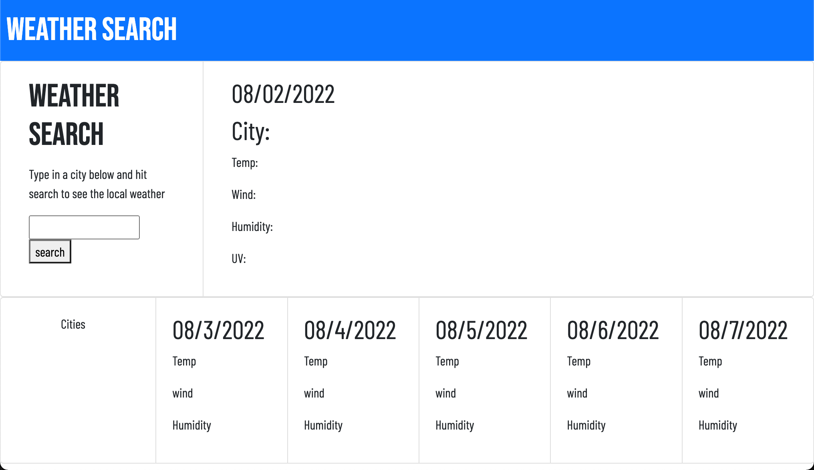
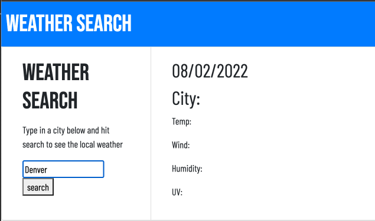
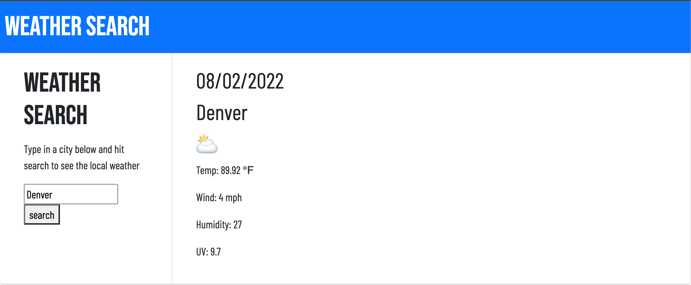
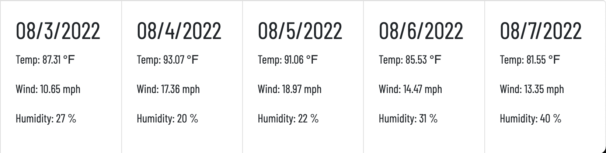

# weather-dashboard-codyp
## Description

My motivation for this Project was to create an app that used a server Side API. I wanted something that myself and friends/family could benefit from so I created a weather dashboard. Although weather dashboards are quite common I wanted to do a case study of how a weather app could be built with knowledge I have gained thus far. For this app I used the Open Weather API for my calls. I also used the built in date function in JavaScrpit to get the dates. I also used local stoarge to save the previous searched cities. 

## Installation
This project has been deployed to GitHub Pages. To get this project up and running, you can follow the deployment link. Or, download the sources files to use this as a template in VS Code. 

Github deployed IO link
- [GitHub Pages](https://cpolland.github.io/weather-dashboard-codyp/)

## Usage
The intial page

Type in the name of the desired city and hit search.

Shows the current date the searched cities current weather conditions.

It also shows that cities 5 day forcast and the dates of those weather conditions. 

## Credits

This was a solo project worked on by Cody Polland.

## Badges

## Features
- City Search forthat lets you search any desire city.
- Shows the searched cities temp, wind, humidity, and UV Index.
- At the bottom the app shows the searched cities 5 day forcast with dates. 
